# SaltGardenia

  

  <em>Hi — welcome to my world.</em> 
  I build where the salt meets the soft.

---

### `01` &nbsp; Origin

- 🎓 Bachelor's in **Intelligent Science and Technology** — Hefei University of Technology
- 🌱 Learning in public, one crystal at a time.

### `02` &nbsp; Reach

- 💌 Email: [icepaper135@gmail.com](mailto:icepaper135@gmail.com)
- 🌐 Site: [saltgardenia.github.io](https://saltgardenia.github.io/#home)

---

Designed as a crystalline bloom — the gardenia that grows in salt.
